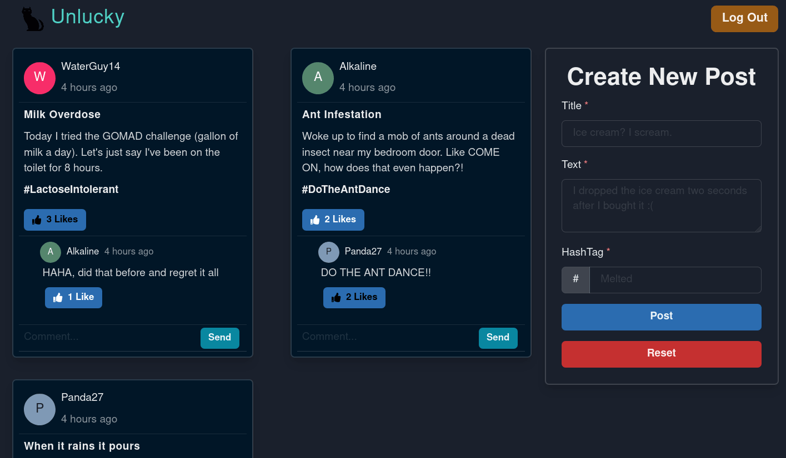

# Unlucky

## View [Live Site](https://unlucky-social-media.netlify.app/)

## Splash Page Screenshot

## Main Page Screenshot

## Description

Unlucky is a social media-esque application where users can post about an unlucky event they had, read posts about other users' unlucky events, and make empathetic comments on posts.

This app is a spin on the traditional 'good news' theme of many applications out there. Sometimes all you see on social media platforms is the highs of people's lifestyle and never any lows. I've also noticed that there are a lot of emerging apps that are designed to pump out 'good news'. Not that there's anything wrong with it, since I personally have an idea for an app that intends to help people's mental health. I wanted to do something different but still simple because the main focus of this project is for me to get some practice designing a RESTful API backend, work with TypeScript/Redux/Redux-Toolkit in React, and try out Figma to pre-design a front-end.

As a learning project where the concept is simple, I don't anticipate a lot of users (if any) to fully utilize the application on a day-to-day basis. If this is the type of content that you're looking for more readily available, then I recommend browsing r/tifu on Reddit :). You can click [here](https://www.reddit.com/r/tifu/) to go to the subreddit.

## Design Docs

- [Figma Mockups](https://github.com/KennethNguyen/unlucky/wiki/Figma-Mockups)
- [MongoDB Database Schema Design](https://github.com/KennethNguyen/unlucky/wiki/MongoDB-Database-Schema-Design)
- [Why did I choose to work with X](https://github.com/KennethNguyen/unlucky/wiki/Choosing-Technologies)

## Backend Server

View [here](https://unluckyapi.herokuapp.com/)

Hyperlink will be updated to the SwaggerUI documentation once I set it up

## Technologies

- Front-End
  - React
  - TypeScript
  - Redux/Redux-Toolkit
  - @Chakra-UI - React UI framework
  - React Router DOM
  - Axios
  - Moment.js
  - Jsonwebtoken
- Back-End
  - Node.js
  - Express
  - Mongoose
  - MongoDB
  - Swagger
  - Jsonwebtoken
  - Bcryptjs
- UI/UX Design
  - [Figma](https://www.figma.com/)
  - [Image of dropped ice cream cone from Unsplash](https://unsplash.com/photos/52jRtc2S_VE)
  - [Cooloers.co](Cooloers.co/image-picker)
  - Color palette is #14 from [Digital Synopsis](https://digitalsynopsis.com/design/color-combinations-palettes-schemes/)
  - Black Cat icon made by [Freepik](https://www.freepik.com) from [FlatIcon](https://www.flaticon.com)
- Hosting
  - Netlify
  - Heroku
- Project Management
  - Notion (Notes + Kanban Board)

## Author

Kenneth Nguyen
